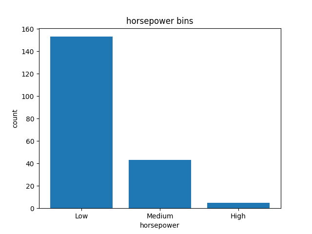

Auto Data Analysis Project
This project provides the correlation between the different parameters of auto dataset. It reads the data from a csv file
and prepare data for analysis by cleaning and replacing missing values, standardize and normalize the data, binning the data
for visualization, converting categorial to columns and finding the correlation between the variable such as horsepower and price,
engine-size and price etc.

raw data:
   symboling normalized_losses         make fuel_type aspiration num_of_doors  ... compression-ratio horsepower peak_rpm  city_mpg  highway_mpg  price
0          3                 ?  alfa-romero       gas        std          two  ...               9.0        111     5000        21           27  13495
1          3                 ?  alfa-romero       gas        std          two  ...               9.0        111     5000        21           27  16500
2          1                 ?  alfa-romero       gas        std          two  ...               9.0        154     5000        19           26  16500
3          2               164         audi       gas        std         four  ...              10.0        102     5500        24           30  13950
4          2               164         audi       gas        std         four  ...               8.0        115     5500        18           22  17450

getting total number of null values based on columns:
number of NaN values for the column normalized_losses : 41
number of NaN values for the column price : 4

Updated the datatype to correct format:
Data types assigned to pandas df=
symboling               int64
normalized_losses       int64
make                   object
fuel_type              object
aspiration           category
num_of_doors           object
body-style             object
drive_wheels           object
engine_location        object
wheel_base            float64
length                float64
width                 float64
height                float64
curb_weight             int64
engine_type            object
num_of_cylinders       object
engine_size             int64
fuel_system            object
bore                  float64
stroke                float64
compression-ratio     float64
horsepower            float64
peak_rpm              float64
city_mpg                int64
highway_mpg             int64
price                 float64
dtype: object

The horsepower column data has been binned that provides better data visualization.
 

After data cleaning, the correlation data for some columns:
                       bore    stroke  compression-ratio  horsepower  engine_size     price
bore               1.000000 -0.055390           0.001263    0.566936     0.572609  0.543155
stroke            -0.055390  1.000000           0.187871    0.098267     0.205928  0.082269
compression-ratio  0.001263  0.187871           1.000000   -0.214514     0.028889  0.071107
horsepower         0.566936  0.098267          -0.214514    1.000000     0.822676  0.809575
engine_size        0.572609  0.205928           0.028889    0.822676     1.000000  0.872335
price              0.543155  0.082269           0.071107    0.809575     0.872335  1.000000

From the above table, we can find out there is a positive correlation between engine size and price,
horsepower and size.